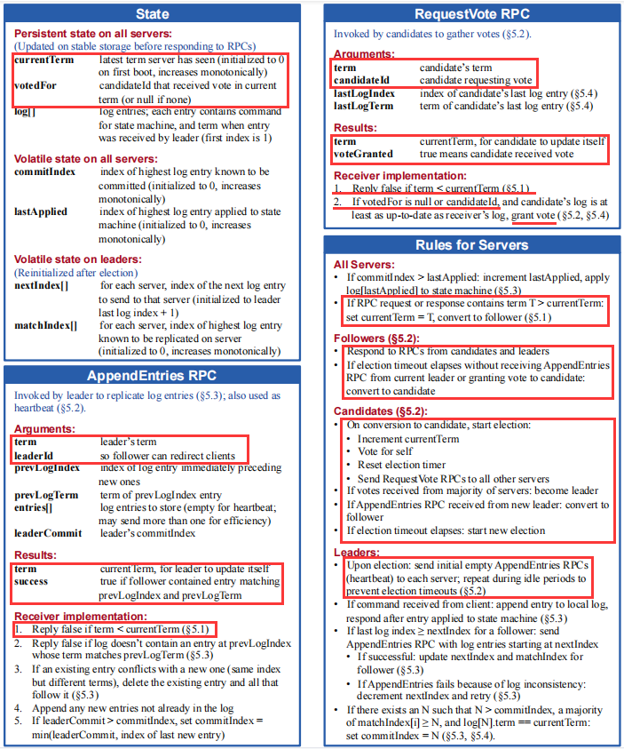

趁着暑假有空，把鸽了很久的 MIT6.824 做一下。Lab1 是实现一个 Map-Reduce，因为和 Raft 主线关系不大（因为懒），就略过了。另外，这次尝试实现一个 part 就来记录相关的内容，以免在全部实现后忘记部分细节（以免之后太懒不想写）。因此难免对 Raft 的整体把握有所不足。

### Resources

- [Course's Page](https://pdos.csail.mit.edu/6.824/index.html) 课程主页
- [Students' Guide to Raft](https://thesquareplanet.com/blog/students-guide-to-raft/) 一篇引导博客
- [Debugging by Pretty Printing](https://blog.josejg.com/debugging-pretty/) debug 技巧，强烈推荐阅读
- [Raft Q&A](https://thesquareplanet.com/blog/raft-qa/) 关于 Raft 的一些 Q&A
- [Raft Visualization](https://raft.github.io/) Raft 动画演示

## Lab2A Raft Leader Election
Lab2A 实现时间为6.22~6.24。

Lab2A 主要实现 Raft 的选主过程，包括选举出 Leader 和 Leader 通过心跳维持身份。

### Design

首先是选主过程的状态机模型：

接下来是 Raft 论文中最为重要的 Figure 2:

Figure 2 有许多关于日志复制等其他部分的内容，在这里暂时先不考虑（但当然还是推荐先整体熟悉 Raft 所有内容后再开始编码）。关于选举部分的内容已经全部在图中标出。一个一个看：

#### State

每个 Raft 节点需要维护的状态：

- `currentTerm` 此节点的任期。
- `votedFor` 在当前任期内，此节点将选票投给了谁。**一个任期内，节点只能将选票投给某一个节点**。因此当节点任期更新时要将 `votedfor` 置为 null。

#### AppendEntries RPC

在领导选举的过程中，`AppendEntries RPC` 用来实现 Leader 的心跳机制。节点的 `AppendEntries RPC` 会被 Leader 定期调用。

**Args**

- `term` Leader 的任期。
- `leaderId` Client 可能将请求发送至 Follower 节点，得知 `leaderId` 后 Follower 可将 Client 的请求重定位至 Leader 节点。因为 Raft 的请求信息必须先经过 Leader 节点，再由 Leader 节点流向其他节点进行同步，信息是单向流动的。**在选主过程中**，`leaderId` **暂时只有 debug 的作用**。

**Reply**

- `term` 此节点的任期。假如 Leader 发现 Follower 的任期高于自己，则会放弃 Leader 身份并更新自己的任期。
- `success` 此节点是否认同 Leader 发送的心跳。

**Receiver Implementation**

1. 当 Leader 任期小于当前节点任期时，返回 false。
2. 否则返回 true。

#### RequestVote RPC

`RequestVote RPC` 会被 Candidate 调用，以此获取选票。

**Args**

- `term` Candidate 的任期
- `candidateId`

**Reply**

- `term` 此节点的任期。假如 Candidate 发现 Follower 的任期高于自己，则会放弃 Candidate 身份并更新自己的任期。
- `voteGranted` 是否同意 Candidate 当选。

**Receiver Implementation**

1. 当 Candidate 任期小于当前节点任期时，返回 false。
2. 如果 `votedFor` 为 null（即当前任期内此节点还未投票）或者 `votedFor`为 `candidateId`（即当前任期内此节点已经向此 Candidate 投过票），则同意投票；否则拒绝投票。

#### Rules for Servers

**All Servers**

- 如果来自其他节点的 RPC 请求中，或发给其他节点的 RPC 的回复中，任期高于自身任期，则更新自身任期，并转变为 Follower。

**Followers**

- 响应来自 Candidate 和 Leader 的 RPC 请求。
- 如果在 election timeout 到期时，Follower 未收到来自当前 Leader 的 AppendEntries RPC，也没有收到来自 Candidate 的 RequestVote RPC，则转变为 Candidate。

**Candidates**

- 转变 Candidate时，开始一轮选举：
  - currentTerm++
  - 为自己投票（votedFor = me）
  - 重置 election timer
  - 向其他所有节点**并行**发送 RequestVote RPC
- 如果收到了大多数节点的选票（voteCnt > n/2），当选 Leader。
- 在选举过程中，如果收到了来自新 Leader 的 AppendEntries RPC，停止选举，转变为 Follower。
- 如果 election timer 超时时，还未当选 Leader，则放弃此轮选举，开启新一轮选举。

**Leaders**

- 刚上任时，向所有节点发送一轮心跳信息
- 此后，每隔一段固定时间，向所有节点发送一轮心跳信息，重置其他节点的 election timer，以维持自己 Leader 的身份。

至此，选主的流程已经比较清晰，接下来是具体的实现。

### Implementation

