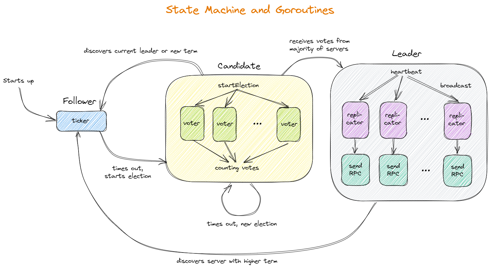
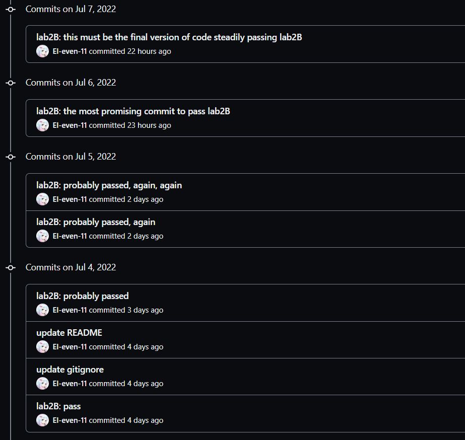
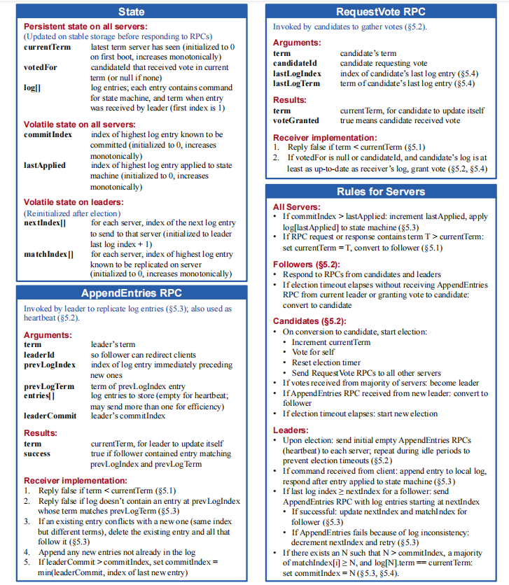
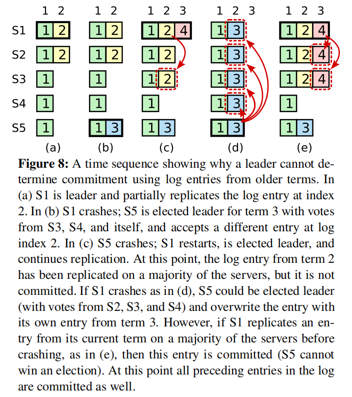
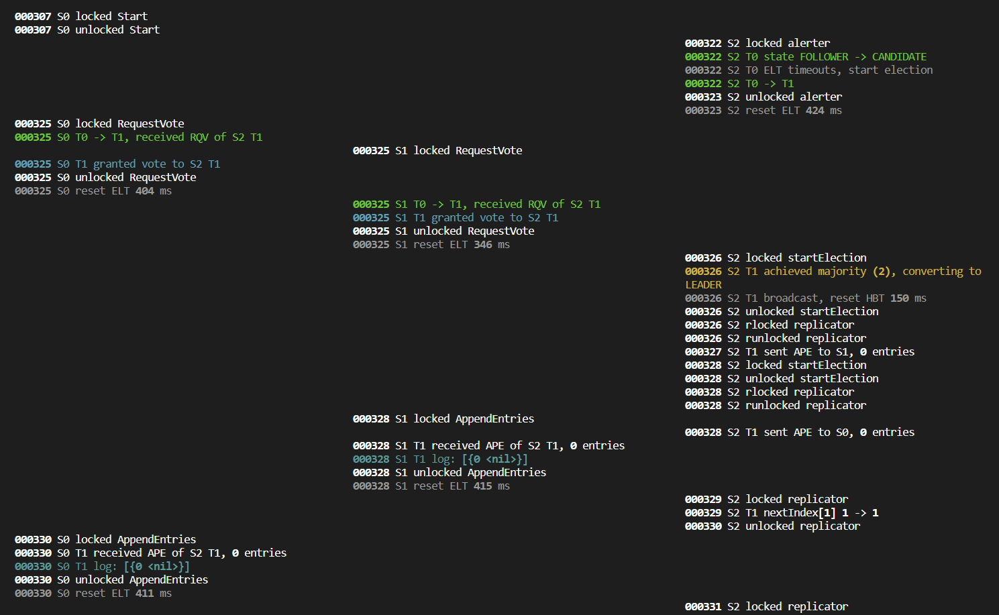
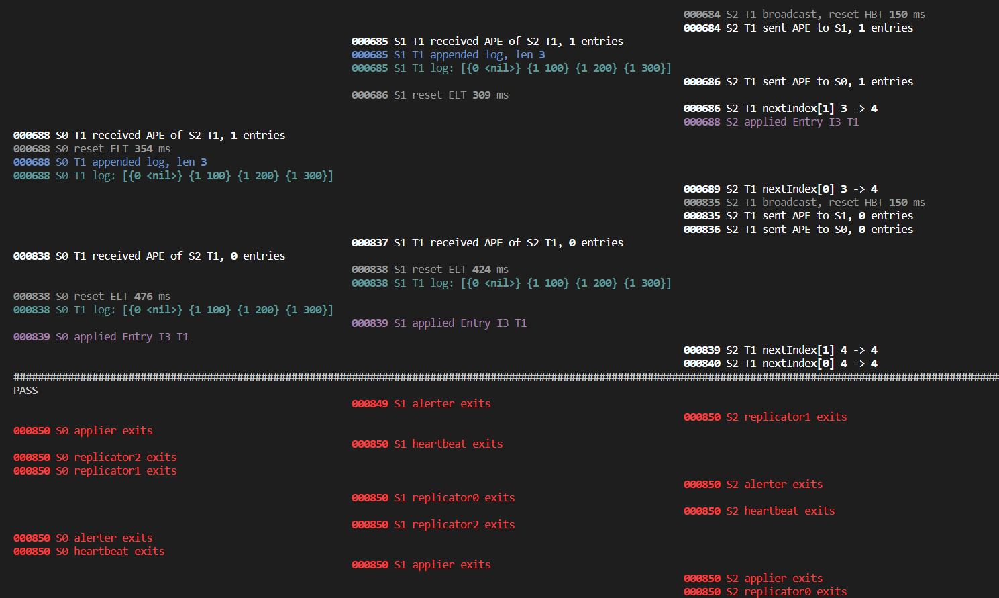
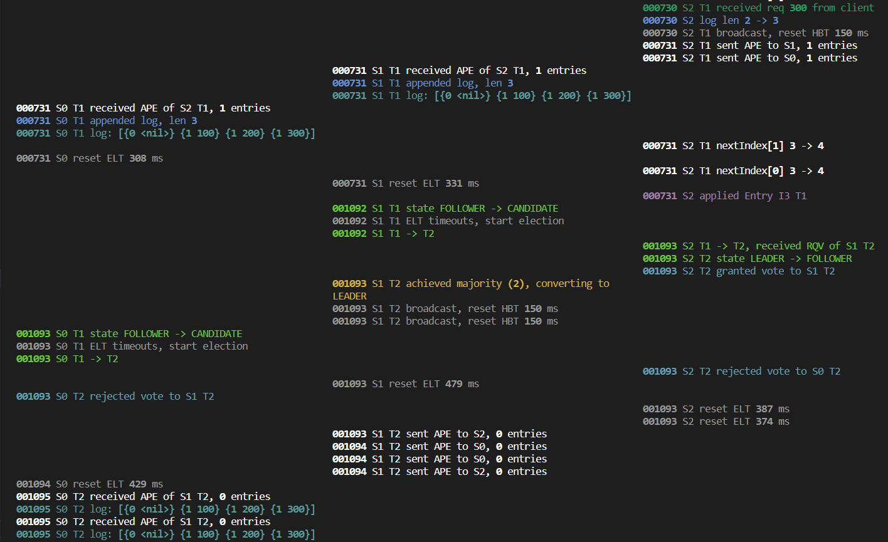

---

title: "MIT6.824 Lab2 Raft"
date: 2022-06-25T00:10:08+08:00
# weight: 1
# aliases: ["/first"]
tags: ["Raft", "Distributed System", "Consensus Algorithm"]
author: "Me"
# author: ["Me", "You"] # multiple authors
showToc: true
TocOpen: true
draft: false
hidemeta: false
comments: false
description: "The implementation of Raft consensus algorithm."
canonicalURL: "https://canonical.url/to/page"
disableHLJS: true # to disable highlightjs
disableShare: true
disableHLJS: false
hideSummary: false
searchHidden: false
ShowReadingTime: true
ShowBreadCrumbs: true
ShowPostNavLinks: true
ShowWordCount: true
ShowRssButtonInSectionTermList: true
UseHugoToc: true
cover:
    image: "../../imgs/lab2A3.png" # image path/url
    alt: "" # alt text
    caption: "" # display caption under cover
    relative: false # when using page bundles set this to true
    hidden: false # only hide on current single page
editPost:
    URL: "https://github.com/el-even-11/blog/content"
    Text: "Suggest Changes" # edit text
    appendFilePath: true # to append file path to Edit link
---

趁着暑假有空，把鸽了很久的 MIT6.824 做一下。Lab1 是实现一个 Map-Reduce，因为和 Raft 主线关系不大（因为懒），就略过了。另外，这次尝试实现一个 part 就来记录相关的内容，以免在全部实现后忘记部分细节（以免之后太懒不想写）。因此，不同 part 的代码会变化，请以最终版本的代码为准（但保证每一 part 的代码可以正常通过**绝大部分**相应的测试）。同时，在写下某一 part 的记录时，我对 Raft 的整体把握也难免有所不足。

## Resources

- [Course's Page](https://pdos.csail.mit.edu/6.824/index.html) 课程主页
- [Students' Guide to Raft](https://thesquareplanet.com/blog/students-guide-to-raft/) 一篇引导博客
- [Debugging by Pretty Printing](https://blog.josejg.com/debugging-pretty/) debug 技巧，**强烈推荐阅读和运用**
- [Raft Q&A](https://thesquareplanet.com/blog/raft-qa/) 关于 Raft 的一些 Q&A
- [Raft Visualization](https://raft.github.io/) Raft 动画演示
- [In Search of an Understandable Consensus Algorithm](https://el-even-11.github.io/Blog/raft-extended.pdf) Raft 论文

## Lab2A Raft Leader Election

Lab2A 实现时间为6.22~6.24。

Lab2A 主要实现 Raft 的选主过程，包括选举出 Leader 和 Leader 通过心跳维持身份。


### Design

首先是选主过程的状态机模型：


接下来是 Raft 论文中最为重要的 Figure 2:


Figure 2 有许多关于日志复制等其他部分的内容，在这里暂时先不考虑（但当然还是推荐先整体熟悉 Raft 所有内容后再开始编码）。关于选举部分的内容已经全部在图中标出。一个一个看：

#### State

每个 Raft 节点需要维护的状态：

- `currentTerm` 此节点的任期。
- `votedFor` 在当前任期内，此节点将选票投给了谁。**一个任期内，节点只能将选票投给某一个节点**。因此当节点任期更新时要将 `votedfor` 置为 null。

#### AppendEntries RPC

在领导选举的过程中，`AppendEntries RPC` 用来实现 Leader 的心跳机制。节点的 `AppendEntries RPC` 会被 Leader 定期调用。

**Args**

- `term` Leader 的任期。
- `leaderId` Client 可能将请求发送至 Follower 节点，得知 `leaderId` 后 Follower 可将 Client 的请求重定位至 Leader 节点。因为 Raft 的请求信息必须先经过 Leader 节点，再由 Leader 节点流向其他节点进行同步，信息是单向流动的。**在选主过程中**，`leaderId` **暂时只有 debug 的作用**。

**Reply**

- `term` 此节点的任期。假如 Leader 发现 Follower 的任期高于自己，则会放弃 Leader 身份并更新自己的任期。
- `success` 此节点是否认同 Leader 发送的心跳。

**Receiver Implementation**

1. 当 Leader 任期小于当前节点任期时，返回 false。
2. 否则返回 true。

#### RequestVote RPC

`RequestVote RPC` 会被 Candidate 调用，以此获取选票。

**Args**

- `term` Candidate 的任期
- `candidateId`

**Reply**

- `term` 此节点的任期。假如 Candidate 发现 Follower 的任期高于自己，则会放弃 Candidate 身份并更新自己的任期。
- `voteGranted` 是否同意 Candidate 当选。

**Receiver Implementation**

1. 当 Candidate 任期小于当前节点任期时，返回 false。
2. 如果 `votedFor` 为 null（即当前任期内此节点还未投票）或者 `votedFor`为 `candidateId`（即当前任期内此节点已经向此 Candidate 投过票），则同意投票；否则拒绝投票。

#### Rules for Servers

**All Servers**

- 如果来自其他节点的 RPC 请求中，或发给其他节点的 RPC 的回复中，任期高于自身任期，则更新自身任期，并转变为 Follower。

**Followers**

- 响应来自 Candidate 和 Leader 的 RPC 请求。
- 如果在 election timeout 到期时，Follower 未收到来自当前 Leader 的 AppendEntries RPC，也没有收到来自 Candidate 的 RequestVote RPC，则转变为 Candidate。

**Candidates**

- 转变 Candidate时，开始一轮选举：
  - currentTerm++
  - 为自己投票（votedFor = me）
  - 重置 election timer
  - 向其他所有节点**并行**发送 RequestVote RPC
- 如果收到了大多数节点的选票（voteCnt > n/2），当选 Leader。
- 在选举过程中，如果收到了来自新 Leader 的 AppendEntries RPC，停止选举，转变为 Follower。
- 如果 election timer 超时时，还未当选 Leader，则放弃此轮选举，开启新一轮选举。

**Leaders**

- 刚上任时，向所有节点发送一轮心跳信息
- 此后，每隔一段固定时间，向所有节点发送一轮心跳信息，重置其他节点的 election timer，以维持自己 Leader 的身份。


至此，选主的流程已经比较清晰，接下来是具体的实现。


### Implementation

需要实现的结构体不再赘述，按照 Figure2 来就行。

首先实现两个RPC:

#### AppendEntries RPC

```go
func (rf *Raft) AppendEntries(args *AppendEntriesArgs, reply *AppendEntriesReply) {
	rf.mu.Lock()
	defer rf.mu.Unlock()
    
	if args.Term < rf.currentTerm {
        // Reply false if term < currentTerm
		reply.Success = false
		reply.Term = rf.currentTerm		
		return
	}

	if args.Term > rf.currentTerm {
        // If RPC request contains term T > currentTerm: 
        // set currentTerm = T, convert to follower
		rf.currentTerm = args.Term
		rf.votedFor = -1
		rf.state = FOLLOWER
	}

    // received AppendEntries RPC from current leader, reset election timer
	rf.electionTimer.Reset(randomElectionTimeout()) 

	reply.Success = true
	reply.Term = rf.currentTerm
}
```

#### RequestVote RPC

```go
func (rf *Raft) RequestVote(args *RequestVoteArgs, reply *RequestVoteReply) {
	rf.mu.Lock()
	defer rf.mu.Unlock()

	if args.Term < rf.currentTerm {
		// Reply false if term < currentTerm
		reply.VoteGranted = false
		reply.Term = rf.currentTerm
		return
	}

	if args.Term > rf.currentTerm {
		// If RPC request contains term T > currentTerm:
		// set currentTerm = T, convert to follower
		rf.currentTerm = args.Term
		rf.votedFor = -1
		rf.state = FOLLOWER
	}

	if rf.votedFor != -1 && rf.votedFor != args.CandidateId {
		// If votedFor is null or candidateId, grant vote; otherwise reject
		reply.VoteGranted = false
		reply.Term = rf.currentTerm
		return
	}

	// grant vote to candidate, reset election timer
	rf.electionTimer.Reset(randomElectionTimeout())
	rf.votedFor = args.CandidateId

	reply.VoteGranted = true
	reply.Term = rf.currentTerm
}
```


可以看到两个 RPC 的实现与 Figure 2 中的规则完全一致。依次实现即可。需要注意的是，处理 RPC 的整个过程中都需要持有锁。另外，在更新节点任期时，一定要同步将`votedFor` 置为 null。

实现完两个 RPC 后，再实现较为复杂的 election 和 heartbeat 过程。


#### Election

在节点的 election timer 过期后，开始选举。因此，节点需要有一个监控 electon timer 的 go routine，ticker。

```go
func (rf *Raft) ticker() {
	for !rf.killed() {
		select {
		case <-rf.electionTimer.C:
			rf.mu.Lock()
			if rf.state == LEADER {
				rf.mu.Unlock()
				break
			}
			rf.state = CANDIDATE
			rf.mu.Unlock()
			go rf.startElection()
		}
	}
}
```

选举过程的 go routine 为 startElection。为什么将选举过程也作为一个 go routine，而不是阻塞地调用函数？因为在规则中提到过，**如果 election timer 超时时，Candidate 还未当选 Leader，则放弃此轮选举，开启新一轮选举**。

接下来看实际负责选举过程的 go routine， startElection。

```go
func (rf *Raft) startElection() {
	rf.mu.Lock()
	rf.currentTerm++                                // Increment currentTerm
	rf.votedFor = rf.me                             // Vote for self
	rf.electionTimer.Reset(randomElectionTimeout()) // Reset election timer
	rf.mu.Unlock()

	args := RequestVoteArgs{CandidateId: rf.me}
	rf.mu.RLock()
	args.Term = rf.currentTerm
	rf.mu.RUnlock()

	voteCh := make(chan bool, len(rf.peers)-1)
	for i := range rf.peers { // Send RequestVote RPCs to all other servers
		if i == rf.me { // in PARALLEL
			continue
		}
		go func(i int) {
			reply := RequestVoteReply{}
			if ok := rf.sendRequestVote(i, &args, &reply); !ok {
				voteCh <- false
				return
			}
			rf.mu.Lock()
			if reply.Term > rf.currentTerm {
				// If RPC response contains term T > currentTerm:
				// set currentTerm = T, convert to follower
				rf.currentTerm = reply.Term
				rf.votedFor = -1
				rf.state = FOLLOWER
				rf.mu.Unlock()
				return
			}
			rf.mu.Unlock()
			voteCh <- reply.VoteGranted
		}(i)
	}

	voteCnt := 1
	voteGrantedCnt := 1
	for voteGranted := range voteCh {
		rf.mu.RLock()
		state := rf.state
		rf.mu.RUnlock()
		if state != CANDIDATE {
			break
		}
		if voteGranted {
			voteGrantedCnt++
		}
		if voteGrantedCnt > len(rf.peers)/2 {
			// gain over a half votes, switch to leader
			rf.mu.Lock()
			rf.state = LEADER
			rf.mu.Unlock()
			go rf.heartbeat()
			break
		}

		voteCnt++
		if voteCnt == len(rf.peers) {
			// election completed without getting enough votes, break
			break
		}
	}
}
```

使用 n-1 个协程向其他节点并行地发送 RequestVote 请求。协程获得 response 后，向 `voteCh` 发送结果，startElection 协程进行结果统计。统计过程中，若发现失去了 Candidate 身份，则停止统计。若获得票数过半，则成功当选 Leader，启动 heartbeat 协程。若所有成员已投票，且未当选 Leader，则退出统计。

要注意的是，需要确保所有不再使用的 go routine 能够正常退出，避免占据资源。

成功当选 Leader 后，开始发送心跳。

#### Heartbeat

```go
func (rf *Raft) heartbeat() {
	wakeChPool := make([]chan struct{}, len(rf.peers))
	doneChPool := make([]chan struct{}, len(rf.peers))
	// allocate each peer with a go routine to send AppendEntries RPCs
	for i := range rf.peers {
		if i == rf.me {
			continue
		}
		wakeChPool[i] = make(chan struct{})
		doneChPool[i] = make(chan struct{})
		go func(i int) { // replicator go routine
			for {
				select {
				case <-wakeChPool[i]:
					args := AppendEntriesArgs{LeaderId: rf.me}
					reply := AppendEntriesReply{}
					rf.mu.RLock()
					args.Term = rf.currentTerm
					rf.mu.RUnlock()

					go func() {
						if ok := rf.sendAppendEntries(i, &args, &reply); !ok {
							return
						}
						rf.mu.Lock()
						if reply.Term > rf.currentTerm {
							rf.currentTerm = reply.Term
							rf.votedFor = -1
							rf.state = FOLLOWER
							rf.mu.Unlock()
							return
						}
						rf.mu.Unlock()
					}()
				case <-doneChPool[i]:
					return
				}
			}
		}(i)
	}

	broadcast := func() {
		for i := range rf.peers {
			if i == rf.me {
				continue
			}
			go func(i int) {
				wakeChPool[i] <- struct{}{}
			}(i)
		}
	}
	broadcast()

	rf.heartbeatTimer = time.NewTimer(HEARTBEAT_INTERVAL)
	for {
		<-rf.heartbeatTimer.C
		if rf.killed() || !rf.isLeader() {
			break
		}
		rf.heartbeatTimer.Reset(HEARTBEAT_INTERVAL)
		broadcast()
	}

	// killed or no longer the leader, release go routines
	for i := range rf.peers {
		if i == rf.me {
			continue
		}
		go func(i int) {
			doneChPool[i] <- struct{}{}
		}(i)
	}
}
```

heartbeat 协程首先为每个节点分配一个 replicator 协程，每个 replicator 协程负责向一个特定的节点发送 AppendEntries RPC。

这些协程由 `wakeChPool[i]` 唤醒。实际上也可以用 `sync.Cond` 条件变量实现，但我不太会用，所以简单地用一组 channel 模拟。

初始化这些协程后，heartbeat 协程首先进行一个初始的 broadcast，对应 Leader 刚当选时发出的一轮心跳。broadcast 即通过 `wakeChPool` 唤醒所有 replicator 协程，向所有节点发出一次心跳。

此后，heartbeat 协程初始化一个 heartbeatTimer，并且在每次 heartbeatTimer 到期时，进行一次 broadcast，通知所有 replicator 协程发送一次心跳。这里需要注意的是，如果节点已经被 kill 或者不再是 Leader，需要中断对 heartbeatTimer 的监听，并且释放所有 replicator 协程。

至此，选主过程和心跳成功实现。


### Devil in the details

Lab2A 难度不算大，然而我还是被一个细节卡住了挺久。

在 6.824 Raft 实验中，已经给我们提供了 RPC 调用的方法，即

```go
rf.peers[server].Call("Raft.RPCName", args, reply)
```

其注释提到，

> Call() is guaranteed to return (perhaps after a delay) *except* if the handler function on the server side does not return.  Thus there is no need to implement your own timeouts around Call().

Call() 是确保一定会返回的，除非在被调用的RPC中阻塞，否则即使模拟的网络中断，Call() 也会正常返回 false。因此不需要再为 Call() 设置一个 Timeout 限制。

然而，经过测试，Call() 的确会确保返回，但返回的时间可能会非常长（3到4秒，具体数值要阅读 labrpc 源码，我还没有仔细阅读）。因此，在 replicator 协程中，每次发送心跳，我们还要再启动一个协程，将 sendAppendEntries 放在此协程中运行，避免哪怕只有几秒钟的阻塞。因为在这几秒中，Leader 可能又发送了新的 heartbeat，或者 Leader 不再是 Leader。

```go
go func(i int) { // replicator go routine
	for {
		select {
		case <-wakeChPool[i]:
			...
			go func() { // launch a new go routine to run sending RPC
				if ok := rf.sendAppendEntries(i, &args, &reply); !ok {
					return
				}
			}()
		case <-doneChPool[i]:
			return
		}
		...
	}
}(i)
```


### Summary

个人感觉 Lab2A 难度最大的地方在于合理控制各个 go routine 的生命周期。锁倒是暂时没碰到什么问题，直接一股脑地把可能存在 data race 的地方全部锁上并及时释放就好。整个选主过程的 go routine 生命周期如下：



Lab2A Leader Election 完成。


## Lab2B Raft Log Replication

Lab2B 开始于 6.28。结束于7.7。

和 Raft 最核心的部分缠斗了一个多星期，终于敢说完成了一个较为稳定的版本，千次测试无一 fail。这段时间摸摸鱼，陪陪女朋友，玩玩游戏（和朋友们一起玩一款叫 Raft 的海上生存游戏，挺巧），无聊的时候再看看 fail 掉的 log，暑假嘛，开心最重要。

关于 Lab2B 感触最深的就是 [Students' Guide to Raft](https://thesquareplanet.com/blog/students-guide-to-raft/) 里的这两段话：

> At first, you might be tempted to treat Figure 2 as sort of an informal guide; you read it once, and then start coding up an implementation that follows roughly what it says to do. Doing this, you will quickly get up and running with a mostly working Raft implementation. And then the problems start.

> Inevitably, the first iteration of your Raft implementation will be buggy. So will the second. And third. And fourth.

完成第一版可以单次 pass 的代码大概用了5个小时左右，接下来信心满满地进行千次测试。然而随后的大部分时间，我基本都在试图从各种诡异的 log 找出出现概率极低的难以复现的 Bug。




### Design

首先还是 Figure 2：



Lab2B 中需要完成 Figure 2 中余下的所有内容。顺带一提的是，Figure 2 与其说是一个 Raft 行为的汇总，更像是一个 coding 的 instruction。Figure 2 中很多地方直接给出了代码的具体行为，而不是给出比较抽象和模糊的规则。这样的好处是，coding 更加简单了，严格遵守 Figure 2 即可；但也有一定的坏处，可能实现完所有部分后，学生（特指我）还是对 Raft 的行为，设计和一致性证明等等比较模糊，仅是机械地遵循了 Figure 2 中给出的规则。下面还是一个一个来介绍：

#### State

- `log[]` 即日志，每条 Entry 包含一条待施加至状态机的命令。Entry 也要记录其被发送至 Leader 时，Leader 当时的任期。Lab2B 中，在内存存储日志即可，不用担心 server 会 down 掉，测试中仅会模拟网络挂掉的情景。
- `commitIndex` 已知的最高的**已提交**的 Entry 的 index。**被提交**的定义为，当 Leader 成功在大部分 server 上复制了一条 Entry，那么这条 Entry 就是一条**已提交**的 Entry。
- `lastApplied` 最高的**已应用**的 Entry 的 index。已提交和已应用是不同的概念，已应用指这条 Entry 已经被运用到状态机上。已提交先于已应用。同时需要注意的是，Raft 保证了已提交的 Entry 一定会被应用（通过对选举过程增加一些限制，下面会提到）。

commitIndex 和 lastApplied 分别维护 log 已提交和已应用的状态，当节点发现 commitIndex > lastApplied 时，代表着 commitIndex 和 lastApplied 间的 entries 处于已提交，未应用的状态。因此应将其间的 entries **按序**应用至状态机。

对于 Follower，commitIndex 通过 Leader AppendEntries RPC 的参数 leaderCommit 更新。对于 Leader，commitIndex 通过其维护的 matchIndex 数组更新。

- `nextIndex[]`  由 Leader 维护，`nextIndex[i]` 代表需要同步给 `peer[i]` 的下一个 entry 的 index。在 Leader 当选后，重新初始化为 Leader 的 last log index + 1。
- `matchIndex[]` 由 Leader 维护，`matchIndex[i]` 代表 Leader 已知的已在 `peer[i]` 上成功复制的最高 entry index。在 Leader 当选后，重新初始化为 0。

不能简单地认为 matchIndex = nextIndex - 1。

nextIndex 是对追加位置的一种猜测，是乐观的估计。因此，当 Leader 上任时，会将 nextIndex 全部初始化为 last log index + 1，即乐观地估计所有 Follower 的 log 已经与自身相同。AppendEntries PRC 中，Leader 会根据 nextIndex 来决定向 Follower 发送哪些 entry。当返回失败时，则会将 nextIndex 减一，猜测仅有一条 entry 不一致，再次乐观地尝试。实际上，使用 nextIndex 是为了提升性能，仅向 Follower 发送不一致的 entry，减小 RPC 传输量。

matchIndex 则是对同步情况的保守确认，为了保证安全性。matchIndex 及此前的 entry 一定都成功地同步。matchIndex 的作用是帮助 Leader 更新自身的 commitIndex。当 Leader 发现一个 N 值，N 大于过半数的 matchIndex，则可将其 commitIndex 更新为 N（需要注意任期号的问题，后文会提到）。matchIndex 在 Leader 上任时被初始化为 0。

nextIndex 是最乐观的估计，被初始化为最大可能值；matchIndex 是最悲观的估计，被初始化为最小可能值。在一次次心跳中，nextIndex 不断减小，matchIndex 不断增大，直至 matchIndex = nextIndex - 1，则代表该 Follower 已经与 Leader 成功同步。

#### AppendEntries RPC

**Args**

- `prevLogIndex`  添加 Entries 的前一条 Entry 的 index。
- `prevLogTerm` prevLogIndex 对应 entry 的 term。
- `entries[]` 需要同步的 entries。若为空，则代表是一次 heartbeat。需要注意的是，不需要特别判断是否为 heartbeat，即使是 heartbeat，也需要进行一系列的检查。因此本文也不再区分心跳和 AppendEntries RPC。
- `leaderCommit` Leader 的 commitIndex，帮助 Follower 更新自身的 commitIndex。

**Receiver Implementation**

1. 若 Follower 在 prevLogIndex 位置的 entry 的 term 与 prevLogTerm 不同（或者 prevLogIndex 的位置没有 entry），返回 false。
2. 如果 Follower 的某一个 entry 与需要同步的 entries 中的一个 entry 冲突，则需要删除冲突 entry 及其之后的所有 entry。需要特别注意的是，**假如没有冲突，不能删除任何 entry**。因为存在 Follower 的 log 更 up-to-date 的可能。
3. 添加 Log 中不存在的新 entry。
4. 如果 leaderCommit > commitIndex，令 commitIndex = min(leaderCommit, index of last new entry)。此即 Follower 更新 commitIndex 的方式。


#### RequestVote RPC

**Args**

- `lastLogIndex` Candidate 最后一个 entry 的 index，是投票的额外判据。
- `lastLogTerm` 上述 entry 的 term。

**Receiver Implementation**

- 只有 Candidate 的 log 至少与 Receiver 的 log 一样新（**up-to-date**）时，才同意投票。Raft 通过两个日志的最后一个 entry 来判断哪个日志更 **up-to-date**。假如两个 entry 的 term 不同，term 更大的更新。term 相同时，index 更大的更新。

  > Raft determines which of two logs is more up-to-date by comparing the index and term of the last entries in the logs. If the logs have last entries with different terms, then the log with the later term is more up-to-date. If the logs end with the same term, then whichever log is longer is more up-to-date.

这里投票的额外限制是为了保证已经被 commit 的 entry 一定不会被覆盖。仅有当 Candidate 的 log 包含所有已提交的 entry，才有可能当选为 Leader。

#### Rules for Servers 

**All Severs**

- 如果 commitIndex > lastApplied，lastApplied++，将 log[lastApplied] 应用到状态机。即前文提到的 entry 从已提交状态到已应用状态的过程。

**Leaders**

- 如果收到了来自 client 的 command，将 command 以 entry 的形式添加到日志。在 lab2B 中，client 通过 Start() 函数传入 command。

- 如果 last log index >= nextIndex[i]，向 peer[i] 发送 AppendEntries RPC，RPC 中包含从 nextIndex[i] 开始的日志。
  - 如果返回值为 true，更新 nextIndex[i] 和 matchIndex[i]。
  - 如果因为 entry 冲突，RPC 返回值为 false，则将 nextIndex[i] 减1并重试。这里的重试不一定代表需要立即重试，实际上可以仅将 nextIndex[i] 减1，下次心跳时则是以新值重试。

- 如果存在 index 值 N 满足：

  - N > commitIndex
  - 过半数 matchIndex[i] >= N
  - log[N].term == currentTerm

  则令 commitIndex = N。

  这里则是 Leader 更新 commitIndex 的方式。前两个要求都比较好理解，第三个要求是 Raft 的一个特性，即 Leader 仅会直接提交其任期内的 entry。存在这样一种情况，Leader 上任时，其最新的一些条目可能被认为处于未被提交的状态（但这些条目实际已经成功同步到了大部分节点上）。Leader 在上任时并不会检查这些 entry 是不是实际上已经可以被提交，而是通过提交此后的 entry 来间接地提交这些 entry。这种做法能够 work 的基础是 Log Matching Property：

  > **Log Matching**: if two logs contain an entry with the same index and term, then the logs are identical in all entries up through the given index.

  原文描述如下：

  > To eliminate problems like the one in Figure 8, **Raft never commits log entries from previous terms by counting replicas**. Only log entries from the leader’s current term are committed by counting replicas; once an entry from the current term has been committed in this way, then all prior entries are committed indirectly because of the Log Matching Property. There are some situations where a leader could safely conclude that an older log entry is committed (for example, if that entry is stored on every server), but Raft takes a more conservative approach for simplicity.

  
  
  这样简化了 Leader 当选的初始化工作，也成功避免了简单地通过 counting replicas 提交时，可能出现的已提交 entry 被覆盖的问题。

到这里 Figure 2 基本介绍完毕。也大致解释了 Figure 2 中各种规则的缘由。Raft 论文中还有更多 Raft 的设计理念、Properties、安全性证明等内容，这里就不再赘述了。


### Implementation

Lab2B 实现的难点应该在于众多的 corner case，以及理想情况与代码执行方式的差异，太多的线程和 RPC 让系统的复杂性骤升，未持有锁的时刻什么都有可能发生。另外还有一个令人纠结的地方，就是各种时机。例如，接收到了 client 的一个请求，什么时候将这条 entry 同步给 Follower？什么时候将已提交的 entry 应用至状态机？更新某一变量时，是起一线程轮询监听，还是用 channel 或者 sync.Cond 唤醒，还是采取 lazy 策略，问到我的时候再去计算？很多实现方式理论上都可以使用，或许也各有各的好处，限于时间，面对很多问题，我也只选择了一种我认为的比较容易实现的方式。

这部分的代码相较于 Lab2A 有一些变动，除了 Lab2B 中新增的内容，主要是对投票过程进行了一些修改。

先说 go routine 的使用。对于所有的初始节点（Follower 节点），包含如下后台 go routines：

- `alerter`：1个。监听 electionTimer 的超时事件和重置事件。超时事件发生时，Follower 转变为 Candidate，发起一轮选举。重置事件发生时，将 electionTimer 重置。
- `applier`：1个。监听 applierCh channel，当节点认为需要一次 apply 时，向 applierCh 发送一次信号，applier 接收信号后会将当前 lastApplied 和 commitIndex 间的所有 entry 提交。
- `heartbeat`：1个。监听 heartbeatTimer 的超时事件，仅在节点为 Leader 时工作。heartbeatTimer 超时后，Leader 立即广播一次心跳命令。
- `replicator`：n-1 个，每一个对于一个 peer。监听心跳广播命令，仅在节点为 Leader 时工作。接收到命令后，向对应的 peer 发送 AppendEntries RPC。

所有节点仅拥有这 4 种长期执行的后台 go routines，以及若干短期执行任务的 go routines。接下来一个一个介绍。

#### alerter

alerter 代码如下：

```go
func (rf *Raft) alerter() {
	doneCh := rf.register("alerter")
	defer rf.deregister("alerter")
	for {
	FORLOOP:
		select {
		case <-rf.elecTimer.timer.C:
			rf.lock("alerter")
			if rf.state == LEADER {
				rf.unlock("alerter")
				break FORLOOP
			}
			select {
			case <-rf.elecTimer.resetCh:
				rf.elecTimer.reset()
				rf.unlock("alerter")
				break FORLOOP
			default:
			}
			// start a new election
			rf.state = CANDIDATE
			rf.startElection()
			rf.unlock("alerter")
		case <-rf.elecTimer.resetCh:
			if !rf.elecTimer.timer.Stop() {
				select {
				case <-rf.elecTimer.timer.C:
				default:
				}
			}
			rf.elecTimer.timer.Reset(randomElectionTimeout())
		case <-doneCh:
			return
		}
	}
}
```

看上去还是有点复杂，下面慢慢来解释。

首先是 `doneCh`。关于在节点被 kill 后，如何让各个后台协程优雅退出，有不少方法。原始代码框架中给出了 `killed()` 方法，希望我们在后台协程长期运行的 for 循环中检查节点是否被 kill。但是这种方法不太好用，原因是 for 循环中常常阻塞在接收 channel 信号的语句。此时虽然进入了 for 循环，但节点可能在阻塞时被 kill，协程无法得知。

我希望能够有一种方式，在 `kill()` 方法被调用后，直接通知所有的后台 goroutines 让其停止运行。

1. 最先想到的是 `context`。go 的 context 包可以用来处理类似的问题，如超时处理等等。基本思想是构建一颗 goroutine 树，父节点拥有关闭子节点的权力。但这里的场景稍微有点不同，不同的协程间不存在父子关系，只是 Raft 节点的不同后台协程。由 Raft 结构体管理，通过广播的方式通知所有协程较为合适。

2. 提到广播机制，就想到了 `sync.Cond` ，条件变量。`sync.Cond` 的 `Broadcast()` 方法似乎与需求很契合，但 `sync.Cond` 的阻塞形式是 `cond.Wait()`，而不是由 channel 阻塞，不太方便配合 select 语句进行多路复用。

3. 最后决定实现一个简单的 channel 广播方法。Raft 节点维护一个 `doneCh` map：

   ```go
   doneCh map[string]chan struct{}
   ```
   
   key 是字符串，为协程的名称。value 是 channel。
   
   在后台协程初始化时，调用`rf.register()` 方法：
   
   ```go
   func (rf *Raft) register(name string) <-chan struct{} {
   	rf.lock()
   	rf.doneCh[name] = make(chan struct{})
   	doneCh := rf.doneCh[name]
   	rf.unlock()
   	return doneCh
   }
   ```
   
   在节点为协程注册一个 key-value，并返回注册生成的 channel，doneCh。
   
   此后，在 select 语句中监听 doneCh，收到信号后，立刻退出协程，并执行 `rf.deregister()`。
   
   ```go
   func (rf *Raft) deregister(name string) {
   	rf.lock()
   	close(rf.doneCh[name])
   	delete(rf.doneCh, name)
   	rf.unlock()
   }
   ```
   
   关闭channel，并清除 map 中对应的 key-value。
   
   当上层调用 `Kill()` 方法时：
   
   ```go
   func (rf *Raft) Kill() {
   	atomic.StoreInt32(&rf.dead, 1)
   	rf.lock("Kill")
   	defer rf.unlock("Kill")
   	for _, ch := range rf.doneCh {
   		go func(ch chan struct{}) { ch <- struct{}{} }(ch)
   	}
   }
   ```
   
   遍历节点维护的 doneCh map，向所有 channel 发送信号，通知其对应的协程立即退出。

这样就实现了在`Kill()`被调用时，第一时间主动通知所有后台协程退出，避免占用系统资源。

接下来是 for 循环中的 select 语句。

- `case <-doneCh:` 是刚才介绍的协程退出的通道。
- `case <-rf.elecTimer.timer.C:` 是 electionTimer 超时事件发生的通道。
- `case <-rf.elecTimer.resetCh:` 是 electionTimer 重置事件发生的通道。

需要注意的是，我在这里对 electionTimer 做了一个简单的封装。其拥有一个 `reset()` 方法。

```go
type electionTimer struct {
	timer   *time.Timer
	resetCh chan struct{}
}

func (timer *electionTimer) reset() {
	go func() { timer.resetCh <- struct{}{} }()
}
```

为什么将 electionTimer 设定得这么复杂？按理来说，超时了就开始选举，需要重置的时候直接重置就好。我一开始也是这么想的，然而遇到了一个比较严重的问题。假如将超时事件按照如下处理：

```go
func alerter() {
	for {
		select {
		case <-electionTimer.C:
			rf.lock()
			if rf.state == LEADER {
				rf.unlock()
				break
			}
			rf.state = CANDIDATE
			rf.startElection()
			rf.unlock()
		}
	}
}
```

假设超时事件发生，程序执行至 rf.lock() ，而此时，节点正在处理 RequestVote RPC，因此 rf.lock() 被阻塞：

```go
func (rf *Raft) RequestVote(args *RequestVoteArgs, reply *RequestVoteReply) {
	rf.lock("RequestVote")
	defer rf.unlock("RequestVote")
	...
	reply.VoteGranted = true
	reply.Term = rf.currentTerm
	rf.votedFor = args.CandidateId
    rf.electionTimer.Reset(randomElectionTimeout())
}
```

节点将选票投给了另一个 Candidate 节点，退出 RPC handler，然后 alerter 协程成功抢占到了锁——悲剧发生了。刚刚投出选票的节点，立马发起了新一轮的选举。

这种情况会不会影响系统的 safety？说实话，我暂时还不太清楚。毕竟只是换一个 Leader 而已。但这种情况的确会造成一些测试的 fail，例如发生 split vote，即同时有多个节点 electionTimer 超时时，会使刚刚上任的 Leader 立马变成 Follower，影响了 liveness。而且很显然，这种情况并不是我们希望看到的，我们希望看到的是，要么 electionTimer 超时，发起一轮选举，要么 electionTimer 被重置，选举不会发生。因此我尝试加以解决。

通过上述分析，可以发现问题的关键在于，超时事件和重置事件不能同时进行，必须互斥进行。因此就有了 alerter 的 select 框架：

```go
FORLOOP:
select {
case <-rf.elecTimer.timer.C:
	rf.lock("alerter")
	if rf.state == LEADER {
		rf.unlock("alerter")
		break FORLOOP
	}
	select {
	case <-rf.elecTimer.resetCh:
		rf.elecTimer.reset()
		rf.unlock("alerter")
		break FORLOOP
	default:
	}
	// start a new election
	rf.state = CANDIDATE
	rf.startElection()
	rf.unlock("alerter")
case <-rf.elecTimer.resetCh:
	if !rf.elecTimer.timer.Stop() {
		select {
		case <-rf.elecTimer.timer.C:
		default:
		}
	}
	rf.elecTimer.timer.Reset(randomElectionTimeout())
case <-doneCh:
	return
}
```

先看重置事件。在封装好的 electionTimer 中，通过调用其 reset 方法将其重置。

```go
func (timer *electionTimer) reset() {
	timer.resetCh <- struct{}{}
}
```

由于需要重置 electionTimer 时，一般持有锁，而重置 electionTimer 也不需要保证同步，因此这里的 resetCh 使用的是带缓存的 channel，不会阻塞。避免循环等待产生死锁，或发送信号阻塞时间过长，影响系统可用性。

alerter 监听重置事件。重置事件发生时，对 electionTimer 进行重置。接下来是很经典的 go 重置 timer 的流程：先将 timer stop，假如 stop 时 timer 已经超时，则尝试将 channel 中的信号取出（若信号还未取出的话）。最后再 reset。

> For a Timer created with NewTimer, Reset should be invoked only on stopped or expired timers with drained channels.

这样就消除了上述的情况，当 select 语句先进入重置处理，若同时 electionTimer 超时，则将其信号取出，阻止其随后再立刻发起一轮选举。

再看超时事件。

如果当前身份已经为 Leader，则忽略超时事件。注意 select 语句中使用 break 的坑。

随后又有一个 select 语句。这一步的目的是，假如 electionTimer 先超时，进入超时处理，此时 reset 信号来了，则将 reset 信号继续传递，并立刻停止超时处理，再下一次循环中将 electionTimer 重置。若没有 reset 信号，则继续后面的步骤。这样做的原因是，重置步骤是异步进行的，且重置事件与超时事件几乎同时发生时，为了保持 Leader 的 liveness，我们更加偏好优先处理重置事件。毕竟重置的信号已经到了，说明自己已经给其他 Candidate 投了票，或者 Leader 的心跳已经到了，没有必须发起一轮新的选举。

实际上，这么做也是我的无奈之举。在正常情况下，Leader 发送心跳不会和 Follower 超时同时发生，因为心跳间隔是小于随机超时时间的最小值的。但我的代码有一个诡异的 bug，在一些时候，整个系统（同一时间，所有节点，所以基本可以排除代码阻塞在某处，或者等待 RPC 的问题）可能会同时停顿一段时间（400ms左右），导致 Leader 权力丧失。后面还会尽量详细介绍这个 bug，我有点怀疑是 gc 导致的，不过也实在没有能力继续排查。因此，只能通过偏好重置来增强 Leader 的 liveness。但实际上和我前面介绍的一样，即使没有这个问题，偏好重置也是更合理的选择。

后面则是发起一轮选举的过程。选举流程相较 Lab2A 有所修改，以下给出代码，就不再做更多的介绍了。

```go
func (rf *Raft) startElection() {
	rf.currentTerm++
	rf.votedFor = rf.me
	rf.elecTimer.reset()

	args := RequestVoteArgs{}
	args.CandidateId = rf.me
	args.Term = rf.currentTerm
	args.LastLogIndex = rf.lastLogIndex()
	args.LastLogTerm = rf.log[rf.lastLogIndex()].Term

	voteGrantedCnt := 1
	// send RequestVote RPCs to all other peers.
	for i := range rf.peers {
		if i == rf.me {
			continue
		}
		go func(i int) {
			reply := RequestVoteReply{}
			if ok := rf.sendRequestVote(i, &args, &reply); !ok {
				return
			}
			rf.lock("startElection")
			defer rf.unlock("startElection")
			if rf.currentTerm != args.Term || rf.state != CANDIDATE {
				// outdated reply, or Candidate has been elected as LEADER
				return
			}
			if reply.Term > rf.currentTerm {
				rf.currentTerm = reply.Term
				rf.votedFor = -1
				rf.state = FOLLOWER
				rf.elecTimer.reset()
				return
			}
			if !reply.VoteGranted {
				return
			}
			voteGrantedCnt++
			if voteGrantedCnt > len(rf.peers)/2 {
				// gain over a half votes, convert to leader
				rf.state = LEADER
				for i := 0; i < len(rf.peers); i++ {
					// reinitialize upon winning the election
					rf.nextIndex[i] = rf.lastLogIndex() + 1
					rf.matchIndex[i] = 0
				}
				rf.broadcast(true)
			}
		}(i)
	}
}
```

需要注意两点：

1. 投票是并行异步，前面已经提到过了。需要额外注意的是，各个 voter routines 发送 RPC 使用的 args 要完全一样，在启动 voter routines 前准备好，不可以在 voter routine 内部各自重新加锁读取 args，否则可能会导致发送的 args 不同。**未持锁时，任何事情都可能发生**。

2. 在接收到 reply 时，一定要判断一下这是不是过期或无效的 reply，比如当前的 term 已经大于 args 的 term，那么这就是一个过期的 reply。论文中介绍过，对于过期的 reply，直接抛弃即可。[Students' Guide to Raft](https://thesquareplanet.com/blog/students-guide-to-raft/) 中也提到了这个问题，引用其中的一段话：

   > From experience, we have found that by far the simplest thing to do is to first record the term in the reply (it may be higher than your current term), and then to compare the current term with the term you sent in your original RPC. If the two are different, drop the reply and return. *Only* if the two terms are the same should you continue processing the reply. There may be further optimizations you can do here with some clever protocol reasoning, but this approach seems to work well. **And *not* doing it leads down a long, winding path of blood, sweat, tears and despair**.

关于 electionTimer 就介绍到这里。实现最初版本的 electionTimer 逻辑并不困难，但要保证完全地 bug-free (我目前的代码也不能保证)，难度还是很大。其中关于重置和超时同时发生的处理方式，也困扰了我很长时间，最终才得出这个较为稳定的版本。

#### applier

applier 代码如下：

```go
func (rf *Raft) applier() {
	doneCh := rf.register("applier")
	defer rf.deregister("applier")
	for {
		select {
		case <-rf.applierCh:
			rf.lock("applier")
			lastApplied := rf.lastApplied
			rf.lastApplied = rf.commitIndex
			entries := append([]LogEntry{}, rf.log[lastApplied+1:rf.commitIndex+1]...)
			rf.unlock("applier")
			for i, entry := range entries {
				command := entry.Command
				rf.applyCh <- ApplyMsg{
					CommandValid: true,
					Command:      command,
					CommandIndex: lastApplied + i + 1,
				}
			}
		case <-doneCh:
			return
		}
	}
}
```

applier 监听 applierCh，当信号到来时，将 lastApplied 到 commitIndex 间的所有 entry 按序应用至状态机。对于 entry 的 apply，采用一种较懒的方式：在 commitIndex 更新时，向 applierCh 异步发送信号即可。

```go
go func() { rf.applierCh <- struct{}{} }()
```

#### heartbeat

heartbeat的代码如下：

```go
func (rf *Raft) heartbeat() {
	doneCh := rf.register("heartbeat")
	defer rf.deregister("heartbeat")
	for {
		select {
		case <-rf.heartbeatTimer.C:
			rf.lock("heartbeat")
			if rf.state != LEADER {
				rf.unlock("heartbeat")
				break
			}
			rf.broadcast(true)
			rf.unlock("heartbeat")
		case <-doneCh:
			return
		}
	}
}
```

heartbeat 的部分也比较简单。heartbeatTimer 超时后，则 broadcast 一轮心跳信息即可。为什么 heartbeatTimer 不用像 electionTimer 那样制定复杂的规则？本质上是因为 heartbeatTimer 超时和重置的时刻都是已知的，可控的，不像 electionTimer 会并行地随时发生。

broadcast 代码如下：

```go
func (rf *Raft) broadcast(isHeartbeat bool) {
	rf.heartbeatTimer.Stop()
	rf.heartbeatTimer.Reset(HEARTBEAT_INTERVAL)
	args := AppendEntriesArgs{}
	args.LeaderCommit = rf.commitIndex
	args.LeaderId = rf.me
	args.Term = rf.currentTerm

	for i := range rf.peers {
		if i == rf.me {
			continue
		}
		if isHeartbeat || rf.nextIndex[i] <= rf.lastLogIndex() {
			go func(i int) {
				rf.apeChPool[i] <- args
			}(i)
		}
	}
}
```

同样，用于 RPC 的 args 要提前准备好，用 channel 传递给每一个 replicator。需要注意的是，有两种事件会调用 broadcast。

一是 heartbeatTimer 超时时，此时 Leader 为了维持权力，必须立刻向所有 peer 发送一次 AppendEntries RPC，即使需要同步的 entry 为空（即论文中所说的 heartbeat）。

二是在上层 client 调用 `Start()` 函数发送命令时：

```go
func (rf *Raft) Start(command interface{}) (int, int, bool) {
	rf.lock("Start")
	defer rf.unlock("Start")
	if rf.state != LEADER {
		return -1, -1, false
	}
	index := rf.logLen() + 1
	term := rf.currentTerm
	isLeader := true
	rf.log = append(rf.log,
		LogEntry{
			Term:    term,
			Command: command,
		},
	)
	rf.broadcast(false)
	return index, term, isLeader
}
```

此时，假如没有需要新同步的 entry，则无需发送一轮空的 AppendEntries RPC。这里的处理参考了 [MIT6.824-2021 Lab2 : Raft](https://zhuanlan.zhihu.com/p/463144886) 的做法。但后来我用 go test cover 的工具简单测试了一下，似乎没有覆盖到无需立即 broadcast 的路径。可能这样的处理是与后续 lab 有关，或者是我的理解有误。

#### replicator

replicator 的代码如下：

```go
func (rf *Raft) replicator(peer int) {
	doneCh := rf.register(fmt.Sprintf("replicator%d", peer))
	defer rf.deregister(fmt.Sprintf("replicator%d", peer))
	for {
		select {
		case args := <-rf.apeChPool[peer]:
			reply := AppendEntriesReply{}
			rf.rlock("replicator")
			args.PrevLogIndex = rf.nextIndex[peer] - 1
			args.PrevLogTerm = rf.log[rf.nextIndex[peer]-1].Term
			if rf.nextIndex[peer] <= rf.lastLogIndex() {
				args.Entries = rf.log[rf.nextIndex[peer]:]
			}
			rf.runlock("replicator")

			go func() {
				if ok := rf.sendAppendEntries(peer, &args, &reply); !ok {
					return
				}
				rf.lock("replicator")
				defer rf.unlock("replicator")
				if rf.currentTerm != args.Term || rf.state != LEADER {
					// outdated reply, or LEADER has no longer been the LEADER
					return
				}
				if reply.Term > rf.currentTerm {
					rf.currentTerm = reply.Term
					rf.votedFor = -1
					rf.state = FOLLOWER
					rf.elecTimer.reset()
					return
				}
				if reply.Success {
					if rf.nextIndex[peer]+len(args.Entries) > rf.lastLogIndex()+1 {
						// repeated reply, ignore
						return
					}
					rf.nextIndex[peer] = args.PrevLogIndex + len(args.Entries) + 1
					rf.matchIndex[peer] = rf.nextIndex[peer] - 1
					N := rf.lastLogIndex()
					for N > rf.commitIndex {
						if rf.log[N].Term != rf.currentTerm {
							N--
							continue
						}
						cnt := 1
						for _, matchidx := range rf.matchIndex {
							if matchidx >= N {
								cnt++
							}
						}
						if cnt <= len(rf.peers)/2 {
							N--
							continue
						}
						rf.commitIndex = N
						go func() { rf.applierCh <- struct{}{} }()
						return
					}
				} else {
					index := -1
					found := false
					for i, entry := range rf.log {
						if entry.Term == reply.ConflictTerm {
							index = i
							found = true
						} else if found {
							break
						}
					}
					if found {
						rf.nextIndex[peer] = index + 1
					} else {
						rf.nextIndex[peer] = reply.ConflictIndex
					}
				}
			}()
		case <-doneCh:
			return
		}
	}
}
```

replicator 也比较复杂。

由于有多个 replicator 需要注册，在注册是记得根据对应 peer 使用不同的注册名。

replicator 监听 broadcast 发送的信号。接收到信号时，向对应 peer 发送 AppendEntries RPC。

需要注意的是，在接收到 reply 时，如果 reply 已经过期，同样需要直接抛弃。另外，由于 RPC 返回所需的时长不固定，有可能第一个 RPC 还没有返回，第二次心跳已经开始，这时会发送两条相同的 RPC，且都会返回 success（假如 Follower 先处理了第一个 RPC 请求，在处理第二个请求时，log 已经包含了需要同步的 entry，但不会发生冲突）。因此，需要先判断一下 nextIndex 是不是已经被更新过了，假如已经被更新，即 `rf.nextIndex[peer]+len(args.Entries) > rf.lastLogIndex()+1`，就代表收到了重复的回复，直接抛弃即可。随后则是 Leader 更新其 commitIndex 的流程。

另外，假如 reply 由于 log 冲突返回了 false，我采用了论文中提到的优化，即 Follower 通过 reply 直接告知 Leader 发生冲突的位置，Leader 不用每次将 nextIndex - 1多次重试。经过测试，这个优化还是挺有必要的，可以显著地缩短 Lab2B 中一项 test 的运行时间。具体方法见 [Students' Guide to Raft : An aside on optimizations](https://thesquareplanet.com/blog/students-guide-to-raft/#an-aside-on-optimizations)：

> The Raft paper includes a couple of optional features of interest. In 6.824, we require the students to implement two of them: log compaction (section 7) and accelerated log backtracking (top left hand side of page 8). The former is necessary to avoid the log growing without bound, and the latter is useful for bringing stale followers up to date quickly.
>
> These features are not a part of “core Raft”, and so do not receive as much attention in the paper as the main consensus protocol. 
>
> The accelerated log backtracking optimization is very underspecified, probably because the authors do not see it as being necessary for most deployments. It is not clear from the text exactly how the conflicting index and term sent back from the client should be used by the leader to determine what `nextIndex` to use. We believe the protocol the authors *probably* want you to follow is:
>
> - If a follower does not have `prevLogIndex` in its log, it should return with `conflictIndex = len(log)` and `conflictTerm = None`.
> - If a follower does have `prevLogIndex` in its log, but the term does not match, it should return `conflictTerm = log[prevLogIndex].Term`, and then search its log for the first index whose entry has term equal to `conflictTerm`.
> - Upon receiving a conflict response, the leader should first search its log for `conflictTerm`. If it finds an entry in its log with that term, it should set `nextIndex` to be the one beyond the index of the *last* entry in that term in its log.
> - If it does not find an entry with that term, it should set `nextIndex = conflictIndex`.
>
> A half-way solution is to just use `conflictIndex` (and ignore `conflictTerm`), which simplifies the implementation, but then the leader will sometimes end up sending more log entries to the follower than is strictly necessary to bring them up to date.

#### RPCs

AppendEntries RPC 代码如下：

```go
func (rf *Raft) AppendEntries(args *AppendEntriesArgs, reply *AppendEntriesReply) {
	rf.lock("AppendEntries")
	defer rf.unlock("AppendEntries")
	if args.Term < rf.currentTerm {
		reply.Success = false
		reply.Term = rf.currentTerm
		return
	}
	if args.Term > rf.currentTerm {
		rf.currentTerm = args.Term
		rf.votedFor = -1
	}
	if rf.state != FOLLOWER {
		rf.state = FOLLOWER
	}
	rf.elecTimer.reset()
	if args.PrevLogIndex > rf.lastLogIndex() || args.PrevLogIndex > 0 && rf.log[args.PrevLogIndex].Term != args.PrevLogTerm {
		// Reply false if log doesn't contain an entry at prevLogIndex whose term matches prevLogTerm
		reply.Success = false
		reply.Term = rf.currentTerm
         // accelerated log backtracking optimization
		if args.PrevLogIndex > rf.lastLogIndex() {
			reply.ConflictTerm = -1
			reply.ConflictIndex = rf.lastLogIndex() + 1
		} else {
			reply.ConflictTerm = rf.log[args.PrevLogIndex].Term
			index := args.PrevLogIndex - 1
			for index > 0 && rf.log[index].Term == reply.ConflictTerm {
				index--
			}
			reply.ConflictIndex = index + 1
		}
		return
	}

	// If an existing entry conflicts with a new one (same index but different terms),
	// delete the existing entry and all that follow it
	for i, entry := range args.Entries {
		index := args.PrevLogIndex + i + 1
		if index > rf.lastLogIndex() || rf.log[index].Term != entry.Term {
			rf.log = rf.log[:index]
			rf.log = append(rf.log, append([]LogEntry{}, args.Entries[i:]...)...)
			break
		}
	}

	if args.LeaderCommit > rf.commitIndex {
		// If leaderCommit > commitIndex, set commitIndex = min(leaderCommit, index of last new entry)
		rf.commitIndex = min(args.LeaderCommit, rf.logLen())
		go func() { rf.applierCh <- struct{}{} }()
	}

	reply.Success = true
	reply.Term = rf.currentTerm
}
```

AppendEntries RPC 没有太多可说的，严格按照 Figure 2 来就好。另外注意这里也需要实现前面说的 accelerated log backtracking optimization。

RequestVote RPC 代码如下：

```go
func (rf *Raft) RequestVote(args *RequestVoteArgs, reply *RequestVoteReply) {
	rf.lock("RequestVote")
	defer rf.unlock("RequestVote")
	if args.Term < rf.currentTerm {
		reply.VoteGranted = false
		reply.Term = rf.currentTerm
		return
	}

	if args.Term > rf.currentTerm {
		rf.currentTerm = args.Term
		rf.votedFor = -1
		if rf.state != FOLLOWER {
			rf.state = FOLLOWER
			rf.elecTimer.reset()
		}
	}

	if rf.votedFor != -1 && rf.votedFor != args.CandidateId {
		reply.VoteGranted = false
		reply.Term = rf.currentTerm
		return
	}

	if rf.logLen() > 0 {
		rfLastLogTerm := rf.log[rf.lastLogIndex()].Term
		rfLastLogIndex := rf.lastLogIndex()
		if rfLastLogTerm > args.LastLogTerm || rfLastLogTerm == args.LastLogTerm && rfLastLogIndex > args.LastLogIndex {
			// If candidate's log is at least as up-to-date as receiver's log, grant vote; otherwise reject
			reply.VoteGranted = false
			reply.Term = rf.currentTerm
			return
		}
	}

	reply.VoteGranted = true
	reply.Term = rf.currentTerm
	rf.votedFor = args.CandidateId
	rf.elecTimer.reset()
}
```

同样也没有说明可说的。按照 Figure 2 来。

Lab2B 的全部实现大致就是这样。回过头来看好像也不是特别复杂，但确实折磨了我很久，看了整整几天的 log。

### Happy Debugging

前面也提到了，对于 Lab2B，实现一版能够通过一次 test，甚至能够通过90%百次 test 的代码并不是特别难，严格按照 Figure2 编写就好。然而，前面 90% 的任务需要 90% 的时间完成，后面 10% 的任务需要另一个 90% 的时间来完成（甚至更久）。

关于 debug，由于 Raft 是个多线程的项目，也有 RPC，因此以往打断点，单步 debug 的方式肯定行不通。实际上，最原始的方法就是最有效的方法，print log。

在编写代码前，强烈推荐阅读 [Debugging by Pretty Printing](https://blog.josejg.com/debugging-pretty/)。这篇博客详细教你如何打日志，并用 python 的 rich 库打印漂亮工整的命令行输出。在编写代码时，记得在关键处增加一些 Debug 语句，时刻掌握系统变化的情况。





这样各节点的状态清晰很多，方便 debug。

同时，在 Lab2B 中，我也遭遇了 Lab2A 中没有碰到的死锁问题。为了追踪锁的使用情况，我对锁做了一点封装。

```go
func (rf *Raft) lock(where string) {
	Debug(dLock, "S%d locked %s", rf.me, where)
	rf.mu.Lock()
}

func (rf *Raft) unlock(where string) {
	Debug(dLock, "S%d unlocked %s", rf.me, where)
	rf.mu.Unlock()
}
```

主要就是增加了一个 debug 语句，对锁的使用情况进行跟踪。有了锁的日志之后，解决死锁问题不算困难。一般都是在同一段代码中不小心锁了两次，或者在发送、接收阻塞 channel 时持有了锁。比较好排查。

### A Confusing Bug

截至 7.19，我已经跑了上万次 Lab2B 的 test。其中仍会出现几次 fail。经过排查，全部都是同一种原因导致，即上文提到过的，整个系统偶尔会出现一次400ms左右的停顿，导致 Leader 失去权力，出现新的 Candidate 并竞选成为 Leader。其中一次日志如下：



这是 Lab2B test 中最简单的 BasicAgreeTest，内容是成功选出 Leader，然后同步3条 entry 即可。正常情况下不会出现 Leader 变动。

日志中每条语句前的时间戳单位为 ms。此时 S2 为 Leader。

可以看到，在 730 ms 时，S2进行了一次心跳，成功将 {1，300} （任期号为1，命令内容为300）同步给 S0 和 S1。我设置的心跳间隔为 150 ms。然而，在 150 ms 后，也就是 880 ms 时，系统没有任何动作。此时 S2 本应该发送一次心跳，告知 S0 和 S1 {1，300} 已提交，可以将其应用至状态机。

在 731 ms 时，S0 的 electionTimer 被 reset 为 308 ms，S1 的 electionTimer 被 reset 为 331 ms。按理说，即使没有接收到 Leader 的心跳，S0 也会在 308 ms 后，也就是 1039 ms 时，S0 electionTimer 超时，发起一轮选举。然而此时系统仍然没有动作。

在 1092 ms 时，所有节点似乎同时苏醒了，S0 和 S1 都发起了一轮选举，S2 也接收到了投票请求。于是 S1 成功当选 Leader。

S1 在当选 Leader 时，所有节点的 log 都是一致的，为 {1，100} {1，200} {1，300}，其中第3条 entry 没有提交。而由于 Raft 的特性，Leader 不会提交不属于其当前任期的 entry，只会在成功同步并提交下一条到来的 entry 时，间接地将第3条 entry 提交。然而不幸的是，第3条 entry 已经是 BasicAgree 会发送的最后一条 entry。因此，在这次 test 中，这条 entry 无法被提交，也就导致了 test fail。

系统出现诡异停顿的原因是什么？是 timer 的种种坑，还是 gc 的锅？原谅我实在没有能力排查，因为这种 bug 出现的概率极低（应该略高于导致 test fail 的频率，因为可能在出现这种 bug 时，test 仍可以通过，导致 bug 被吞掉），并且这种 bug 实际上可以看成是所有节点同时 down 掉几百毫秒，对于 Raft 系统来说应该是可以容忍的，可能只会造成一次 Leader 更替。导致 test fail 的直接原因是 Raft 不直接提交不属于当前任期 entry 的特性，和 test 刚好没有后续需要同步的 entry。

这里就留下一个遗憾吧，希望我以后有能力排查，到底是哪里出了问题。

### Summary

做完 Lab2B 的感觉很爽，但过程也真的很痛苦。从自信地通过第一次 test，到好几个痛苦 debug 的深夜，再到最后的成功实现。有种便秘的酣畅淋漓的感觉（？）。Lab2A 和 Lab2B 是 Raft 算法的核心内容，能够成功撸下来还是有一点点小小的成就感的。

另外想说的是。6.824 Guidance 中提到了，对于计时操作，不要使用 go timer 或者 ticker，而是应该使用 sleep，在醒来时检查各种变量来实现。然而我还是硬着头皮用了 timer，毕竟这样更加直观，或许也更优雅。然而我不知道这是不是一个正确的选择。因为 timer 的各种诡异现象 debug 到破防的时候，我也想过是不是该推倒重来，全部换成 sleep。最终翻了很多篇博客和资料，还是勉强做出了这个能用的版本。是不是真的用 sleep 更容易实现呢？我也不知道。也许选择比努力更重要，但还是要坚持自己的选择，继续努力吧。


## Lab2C  Raft Persistence

对 lab2C，guidance 中给出了 hard 的难度，但实际上只要认真完成了 lab2B，lab2C 应该是 easy。

Raft 节点挂掉后，在重新恢复时，会从 disk 中读取其此前的状态。Figure 2 中已经告诉我们哪些状态需要持久化：

- currentTerm
- votedFor
- log

因此，只要我们对这些变量进行了修改，就需要进行一次持久化，将这些变量记录在 disk 上。（实际上，这样可能对性能有所影响，因为写入 disk 的 IO 操作比较耗时，但对 6.824 来说这样的简单处理没有问题）

在 lab2C 中，我们不需要真的将状态写入 disk，为了简化代码和方便测试，lab2C 提供了给我们一个 persister 类。在需要对状态进行持久化时，使用 Raft 初始化时传入的 persister 对象对其存储即可。读取状态时也从 persister 中读取。

需要实现 `persist()` and `readPersist()` 两个函数：

```go
func (rf *Raft) persist() {
	w := new(bytes.Buffer)
	e := labgob.NewEncoder(w)
	e.Encode(rf.currentTerm)
	e.Encode(rf.votedFor)
	e.Encode(rf.log)
	data := w.Bytes()
	rf.persister.SaveRaftState(data)
}

func (rf *Raft) readPersist(data []byte) {
	if data == nil || len(data) < 1 { // bootstrap without any state?
		return
	}

	r := bytes.NewBuffer(data)
	d := labgob.NewDecoder(r)
	var currentTerm int
	var votedFor int
	var log []LogEntry
	if d.Decode(&currentTerm) != nil || d.Decode(&votedFor) != nil || d.Decode(&log) != nil {
		panic("readPersist decode fail")
	}

	rf.currentTerm = currentTerm
	rf.votedFor = votedFor
	rf.log = log
}
```

之后在 Raft 改变 currentTerm、votedFor 或 log 时，及时调用 `rf.persist()` 即可。


## Lab2D Raft Log Compaction

